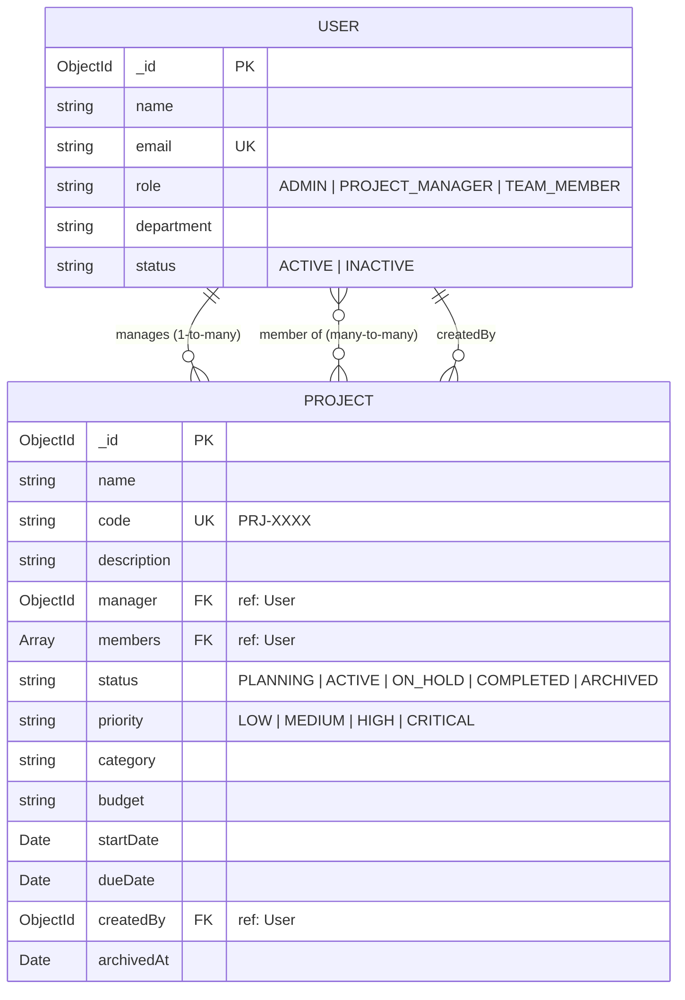
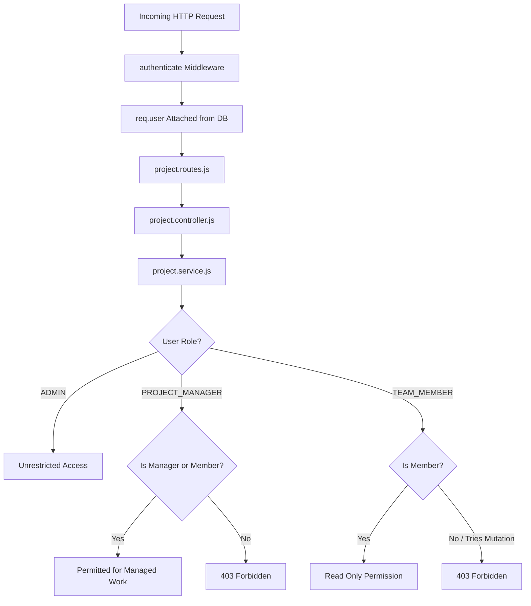

# Project & Task Management System — Architecture (Phase 1)

## Overview
This document outlines frontend architecture for Phase 1 of the Project & Task Management System, prepared for Thinqloud Solutions Pvt. Ltd. campus recruitment drive.

Phase 1 focuses exclusively on a professional, responsive, interview-ready frontend with mock data, dynamic business calculations, and React state/context architecture designed for zero-friction migration to a Node.js/Express/MongoDB MERN backend in Phase 2.

---

## High-Level System Architecture

```mermaid
graph TD
    User([End User / Browser]) --> Router[React Router DOM v7]
    Router --> AuthGuard[ProtectedRoute / RoleGuard]
    
    subgraph State Layer
        AuthCtx[AuthContext (Mock Auth + RBAC)]
        ProjCtx[ProjectContext (Projects, Tasks, Activities)]
    end
    
    subgraph UI Layout
        AppLayout[AppLayout]
        Sidebar[Collapsible Sidebar]
        Header[Header + Notifications + UserMenu]
    end
    
    subgraph Pages
        LoginPage[Login / Role Selector]
        DashboardPage[Dashboard / KPI Cards]
        ProjectsPage[Projects / Filter / CRUD]
        ProjectDetail[Project Detail + Task Breakdown]
        TasksPage[Task List / Filters / Sort]
        TaskDetail[Task Detail + Dependencies]
        MyTasks[My Tasks View]
        OverduePage[Dedicated Overdue View]
        TeamPage[Team / RBAC Readiness]
        ProfilePage[User Profile]
        NotFound[404 & Unauthorized]
    end

    subgraph Service & Utility Layer
        Utils[Task Utilities & Progress Engine]
        Storage[LocalStorage Mock Sync]
    end

    AuthGuard --> AppLayout
    AppLayout --> Pages
    Pages --> ProjCtx
    Pages --> AuthCtx
    ProjCtx --> Utils
    ProjCtx --> Storage
```

---

## Component & Directory Hierarchy

```
frontend/
├── src/
│   ├── assets/              # Icons, logos, branding assets
│   ├── components/
│   │   ├── common/          # Atomic reusable UI components
│   │   │   ├── Button.jsx
│   │   │   ├── Input.jsx
│   │   │   ├── Select.jsx
│   │   │   ├── Modal.jsx
│   │   │   ├── ConfirmationModal.jsx
│   │   │   ├── LoadingSpinner.jsx
│   │   │   ├── EmptyState.jsx
│   │   │   ├── ErrorMessage.jsx
│   │   │   ├── StatusBadge.jsx
│   │   │   ├── PriorityBadge.jsx
│   │   │   ├── ProgressBar.jsx
│   │   │   ├── StatCard.jsx
│   │   │   ├── SearchBar.jsx
│   │   │   ├── FilterBar.jsx
│   │   │   ├── UserAvatar.jsx
│   │   │   └── DeadlineBadge.jsx
│   │   ├── layout/          # Shell layout components
│   │   │   ├── Header.jsx
│   │   │   ├── Sidebar.jsx
│   │   │   └── AppLayout.jsx
│   │   ├── dashboard/       # Dashboard widgets
│   │   │   ├── StatsOverview.jsx
│   │   │   ├── ProjectProgressCard.jsx
│   │   │   ├── UpcomingDeadlinesCard.jsx
│   │   │   ├── OverdueTasksCard.jsx
│   │   │   └── RecentActivityCard.jsx
│   │   ├── projects/        # Project-specific domain widgets
│   │   │   ├── ProjectCard.jsx
│   │   │   ├── ProjectTable.jsx
│   │   │   └── ProjectModal.jsx
│   │   └── tasks/           # Task-specific domain widgets
│   │       ├── TaskTable.jsx
│   │       ├── TaskCard.jsx
│   │       ├── TaskModal.jsx
│   │       └── DependencyBadge.jsx
│   ├── context/
│   │   ├── AuthContext.jsx  # Mock RBAC & authentication state
│   │   └── ProjectContext.jsx # Global mock data state (Projects, Tasks, Logs)
│   ├── data/
│   │   ├── mockUsers.js     # Enterprise user profiles with 3 distinct roles
│   │   ├── mockProjects.js  # Realistic project entities with metadata
│   │   ├── mockTasks.js     # Interconnected tasks with dependencies
│   │   └── mockActivities.js # Audit trail / recent events
│   ├── pages/
│   │   ├── auth/LoginPage.jsx
│   │   ├── dashboard/DashboardPage.jsx
│   │   ├── projects/ProjectsPage.jsx
│   │   ├── projects/ProjectDetailPage.jsx
│   │   ├── tasks/TasksPage.jsx
│   │   ├── tasks/TaskDetailPage.jsx
│   │   ├── tasks/MyTasksPage.jsx
│   │   ├── tasks/OverduePage.jsx
│   │   ├── users/TeamPage.jsx
│   │   ├── profile/ProfilePage.jsx
│   │   └── common/NotFoundPage.jsx
│   ├── routes/
│   │   ├── AppRoutes.jsx    # React Router definitions
│   │   └── ProtectedRoute.jsx # Frontend RBAC route wrapper
│   ├── services/
│   │   └── apiService.js    # Abstraction layer returning mock data or Axios in Phase 2
│   ├── styles/
│   │   ├── index.css        # Clean enterprise CSS design system
│   │   └── components.css   # Component styling tokens
│   ├── utils/
│   │   ├── taskUtils.js     # isTaskOverdue, calculateProgress, getStatistics
│   │   ├── formatters.js    # Date, currency, string helpers
│   │   └── validators.js    # Form input validation rules
│   ├── App.jsx
│   └── main.jsx
├── docs/
│   ├── architecture.md
│   └── phase-1.md
├── README.md
└── .gitignore
```

---

## State & Data Flow Architecture

### 1. Mock Authentication & Role-Based Access Control (RBAC)
- **Roles**:
  - `Admin`: Full control across projects, tasks, user assignments, and configurations.
  - `Project Manager`: Project creation, management, task assignment, progress tracking.
  - `Team Member`: View assigned projects, update task statuses and progress, manage personal workload.
- **Implementation**:
  - `AuthContext` provides current active mock user (`currentUser`), `isAuthenticated`, and role inspection helpers (`isAdmin`, `isProjectManager`).
  - Preloaded demo user switchers allow instantaneous switching between roles during interview demonstrations.
  - `ProtectedRoute` protects private routes and redirects unauthenticated visits to `/login`.

### 2. Project & Task Store (`ProjectContext`)
- Maintains reactive in-memory state initialized from realistic seed mock datasets.
- Automatically persists mutations (Create/Update/Delete) to browser `localStorage` so edits survive page refresh during interviews.
- Provides fallback reset button to instantly restore pristine mock demo data.

### 3. Business Logic & Calculation Utilities (`taskUtils.js`)
Derived metrics are dynamically computed rather than hardcoded:
- `isTaskOverdue(task)`: Evaluates `new Date(task.dueDate) < startOfDay(now)` and `task.status !== 'Completed'`.
- `getDaysOverdue(task)`: Computes exact day discrepancy for overdue tasks.
- `calculateProjectProgress(tasks)`: Aggregates completion percentage `(completedTasks / totalTasks) * 100` or weighted progress.
- `getProjectTaskStatistics(tasks)`: Calculates breakdown counts (Total, Completed, In Progress, To Do, Blocked, Overdue).
- `filterTasks(tasks, filters)`: Multi-criteria filtering by search keyword, project ID, assignee ID, priority, status, and overdue flag.

---

## Phase 2: Backend Foundation & Real Authentication Architecture

In Phase 2, the application transitions from mock-only authentication to a production-style MERN backend. The frontend presentation components and mock-driven project/task data layers are strictly preserved, while authentication and user management are connected to a live Express API and MongoDB database.

### End-to-End Request Pipeline

```mermaid
graph TD
    Browser[React Frontend (Vite)] -->|HTTP Request credentials: 'include'| Express[Express REST API]
    
    subgraph Express Middleware Pipeline
        Helmet[Helmet Security Headers]
        CORS[CORS (Origin: localhost:5173, Credentials: true)]
        RateLimit[Rate Limiter (Auth & General)]
        BodyCookie[JSON & Cookie Parser]
        AuthMw[authenticate Middleware (JWT verification)]
        RbacMw[authorize Middleware (RBAC Check)]
        ValMw[validateBody / validateParams (Zod)]
    end

    subgraph Backend Application Layers
        Controllers[Controllers (HTTP Translation)]
        Services[Services (Business Logic)]
        Repositories[Repositories (Data Access)]
        MongooseODM[Mongoose ODM]
    end

    subgraph Data Store
        MongoDB[(MongoDB Database)]
    end

    Express --> Helmet
    Helmet --> CORS
    CORS --> RateLimit
    RateLimit --> BodyCookie
    BodyCookie --> ValMw
    ValMw --> AuthMw
    AuthMw --> RbacMw
    RbacMw --> Controllers
    Controllers --> Services
    Services --> Repositories
    Repositories --> MongooseODM
    MongooseODM --> MongoDB
```

---

### Layer Responsibilities

1. **Client / Browser (React)**:
   - Manages UI presentation, local state, and form interactions.
   - `apiService.js` transmits HTTP requests with `credentials: 'include'`.
   - Never accesses or stores JWT tokens in JavaScript; relies on browser-managed HttpOnly cookies.
   - Restores session on mount via `GET /api/auth/me`.

2. **Security & Protocol Middleware**:
   - **Helmet**: Sets defensive HTTP response headers (X-Frame-Options, XSS protections, HSTS).
   - **CORS**: Enforces origin restrictions to `http://localhost:5173` with credentials allowed. Rejects wildcard access.
   - **Rate Limiting**: Enforces max 10 requests per 15 minutes on auth endpoints to thwart brute-force password guessing.
   - **Cookie Parser**: Parses incoming `Cookie` header into `req.cookies`.

3. **Authentication & Authorization Middleware**:
   - **`authenticate`**: Extracts JWT from `req.cookies.token`, verifies signature with `JWT_SECRET`, retrieves active user from MongoDB, attaches sanitized user to `req.user`.
   - **`authorize(...roles)`**: Validates `req.user.role` against authorized role list. Throws `403 Forbidden` if unauthorized.

4. **Validation Middleware (`validateBody`, `validateParams`)**:
   - Executes Zod schemas against incoming payloads.
   - Rejects malformed bodies or invalid MongoDB ObjectIds with `400 Bad Request` before reaching controllers.

5. **Controllers**:
   - Extracts request body/parameters.
   - Delegates business workflows to services.
   - Sets HttpOnly auth cookie upon login or clears it on logout.
   - Formats standardized JSON responses: `{ success: true, message: '...', data: {...} }`.

6. **Services**:
   - Contains core business logic (credential verification, conflict checking, password hashing).
   - Independent of HTTP transport (no `req`/`res` objects).

7. **Repositories**:
   - Isolates direct database queries using Mongoose queries (`findById`, `findOne`, `create`, `updateOne`).
   - Keeps service layer decoupled from specific ODM implementations.

8. **Mongoose Models & MongoDB**:
   - Defines strict schema types, enums, indexes, and transformations.
   - Persists records in MongoDB with `_id` primary keys and automatic timestamps.

---

## Phase Boundary & Data Compatibility (Phase 2 & Phase 3 Status)

| Domain | Phase 1 Status | Phase 2 Status | Phase 3 Status | Phase 4 Roadmap |
| :--- | :--- | :--- | :--- | :--- |
| **Authentication** | Mock (in-memory) | **Real (JWT + HttpOnly Cookie)** | **Real (JWT + HttpOnly Cookie)** | Refresh Tokens / 2FA |
| **User Management** | Mock users list | **Real (MongoDB User Model)** | **Real (MongoDB User Model)** | Profile Picture Uploads |
| **RBAC** | Frontend-only UX switcher | **Server-side Enforced Boundary** | **Resource-level Authorization** | Workspace Role Customization |
| **Projects** | Mock / localStorage | Mock / localStorage | **Real (MongoDB Project Model)** | Project Templates |
| **Tasks** | Mock / localStorage | Mock / localStorage | **Mock / localStorage (Strict)** | MongoDB Task Model & REST API |
| **Dependencies** | Client-side DAG check | Client-side DAG check | **Client-side DAG check** | Backend Topological Sort / Cycle Check |

---

## Phase 3: Project & Team Management Architecture

Phase 3 transitions project management into the real MongoDB database while maintaining strict phase isolation for tasks.

### Entity Relationship Model



### Relationship Design & Mongoose Populate Strategy
1. **Manager Reference (`Project.manager`)**:
   - Single `ObjectId` referencing `User` model.
   - Enforces that assigned user must have role `ADMIN` or `PROJECT_MANAGER` and be `ACTIVE`.
   - Populated with safe user fields: `_id name email role avatar department`.
2. **Team Members (`Project.members`)**:
   - Array of `ObjectId` references to `User` model.
   - Manager is always guaranteed inclusion in this array.
   - Populated dynamically via `.populate('members', '_id name email role avatar department')`.
3. **Audit Tracking (`Project.createdBy`)**:
   - Populated from the authenticated session user (`req.user._id`).
4. **Why Document References instead of Embedding**:
   - Users are first-class organizational entities whose names, roles, avatars, and departments change over time. Storing `ObjectId` references ensures profile updates propagate instantly across all projects without writing updates to multiple project documents.
   - Avoids BSON document size bloat and ensures referential consistency.

---

### Resource-Level Authorization Flow




